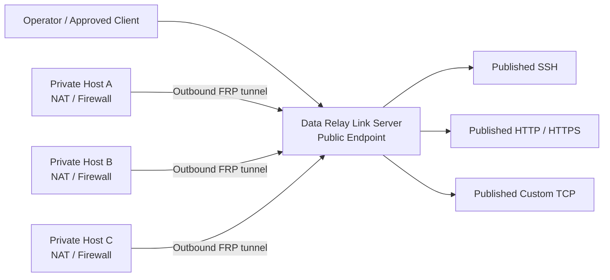

<h1 align="center">Data Relay Link</h1>

<p align="center">
  <strong>격리·제한 네트워크를 위한 Secure Connectivity.</strong>
</p>

<p align="center">
  네트워크 전체를 연결하지 않고 실제로 필요한 연결만 Relay합니다.
</p>

<p align="center">
  <a href="README.md">English</a> · <strong>한국어</strong> · <a href="https://link.datarelay.run/">제품 웹사이트</a>
</p>

<p align="center">
  
  
  
  
</p>

<p align="center">
  <strong>제품 웹사이트:</strong> <a href="https://link.datarelay.run/">link.datarelay.run</a>
</p>

---

## 필요한 연결만 만듭니다

Data Relay Link는 공식 pinned [`fatedier/frp`](https://github.com/fatedier/frp)를 기반으로 한 lightweight, CLI-first secure connectivity layer입니다.

NAT, Firewall, 제한 네트워크 뒤의 시스템이 사용자가 관리하는 Server로 outbound 연결을 만들고, 사용자가 의도적으로 허용한 서비스만 외부에 노출합니다.

Full VPN, network overlay, RMM platform, custom FRP fork를 구축하는 복잡성을 피하는 것이 목적입니다.

## 주요 기능

| 기능 | 제공하는 것 |
|---|---|
| **Zero-Touch Enrollment** | Short-lived enrollment credential을 이용한 빠른 Client 등록 |
| **Stable Identity** | Immutable Client identity와 persistent service identity |
| **Stable Endpoint** | 정상 lifecycle 동작에서 public-port reservation 유지 |
| **Service Publishing** | SSH, HTTP, HTTPS passthrough, Custom TCP |
| **LAN Reachability** | Client local service 또는 Client가 접근 가능한 internal-LAN service 공개 |
| **Access Control** | Named Access List, temporary TTL source, connection authorization log |
| **Health & Operations** | Target Health Check, Support Bundle, lifecycle command, backup/restore |
| **Cross-platform Client** | 검증 matrix에 따른 Linux, macOS, Windows 지원 |
| **Single Operator Interface** | 일반 운영은 `sudo frpctl`로 관리 |

## Architecture



Server는 Linux 기반입니다. macOS와 Windows는 release validation에 따라 Client platform으로 지원됩니다.

## Release 상태

현재 default `main` branch는 FRP **v0.71.0**을 사용하는 **v2.3.0 stable/audit-closure line**을 설명합니다.

차세대 v2.4.0 control-plane redesign은 별도 branch에서 개발 중입니다.

[`feature/v2.4.0-final-product-closure`](https://github.com/datarelay-labs/datarelay-link/tree/feature/v2.4.0-final-product-closure)

v2.4.0 development branch의 target behavior는 stable branch에 통합되고 immutable exact HEAD에서 qualification되기 전까지 stable v2.3.0 기능으로 간주하지 않습니다.

## 빠른 시작

v2.3.0 stable line에서 현재 README contract가 사용하는 immutable release installer path:

```bash
curl -fsSL \
  https://raw.githubusercontent.com/datarelay-labs/datarelay-link/v2.3.0/dist/bootstrap-server.sh \
  | sudo bash
```

설치 후 확인:

```bash
sudo frpctl show version
sudo frpctl show status
sudo frpctl doctor
```

Data Relay Link는 외부 firewall/NAT, cloud security group, DNS provider record, SSH account, application certificate를 자동으로 변경하지 않습니다.

현재 제품 문서는 **https://link.datarelay.run/** 에서 시작합니다.

## Deployment Mode

### Direct

v2.3.0 line의 일반적인 public port:

```text
TCP/443        FRP control
TCP/6099       Enrollment / management HTTPS
TCP/6000-6098 Published services
```

### Enterprise single-443

Control과 enrollment를 TCP/443으로 제한해야 하는 환경:

```text
Public TCP/443
  ├─ HTTPS enrollment / management
  └─ FRP control over WSS

Published services
  └─ TCP/6000-6098
```

NAT는 network topology이며 별도의 product mode가 아닙니다.

## Zero-Touch Enrollment

Server에서:

```bash
sudo frpctl
```

Guided flow:

```text
create zero-touch
```

또는 명시적인 SSH enrollment:

```bash
sudo frpctl create enrollment \
  --one-line \
  --ssh \
  --ssh-user admin \
  --label branch-a
```

Target OS account는 미리 존재해야 합니다. Zero-Touch는 사용자 생성, 비밀번호 설정, SSH Server 설치, SSH key 수정, `sshd_config` 변경을 하지 않습니다.

## Service Lifecycle

다음 동작은 서로 다른 의미를 가집니다.

```text
disable   != release
revoke    != release
uninstall != release
update    != re-enrollment
```

| 동작 | Identity | Public Port |
|---|---|---|
| Service disable / enable | 유지 | 같은 reservation 재사용 |
| Service edit | 유지 | 보존 |
| Client revoke | management 차단 | reserved |
| Service release | Client 유지 | 해당 Service port release |
| Client release | 제거 | release |
| Local Client uninstall | Server identity 유지 | reserved |
| Normal update | 유지 | 유지 |

정상 update는 identity, service, public-port reservation을 보존하도록 설계되어 있습니다.

## 지원 Client Platform — v2.3.0

Real-host validation과 CI/container portability를 구분합니다.

| Platform | 현재 claim |
|---|---|
| Ubuntu 24 physical host | **Real E2E validated** |
| Rocky Linux 8.10 | **Real E2E validated** |
| Rocky Linux 9.4 | **Real E2E validated** |
| Amazon Linux 2023 | **Real E2E validated** |
| macOS Apple Silicon | **Real E2E validated** |
| Windows 10 / PowerShell 5.1 | **Real E2E validated** |
| Amazon Linux 2 | Container / CI portability only |
| PowerShell 7 | CI validated; `pwsh`가 있는 host만 same-host Real E2E claim 가능 |

Authoritative release-validation classification은 [`docs/RELEASE_VALIDATION.md`](docs/RELEASE_VALIDATION.md)에서 관리합니다.

## Security Model

Management plane은 fail-closed를 기본으로 합니다.

- HTTPS-only enrollment/management
- Private CA와 bootstrap CA pinning
- Persistent Client management identity
- Signed request
- Timestamp/nonce replay protection
- High-entropy, TTL, single-use Zero-Touch credential
- First-machine binding
- Bootstrap secret hash-at-rest
- FRP tunnel credential과 management identity 분리
- Installer/release artifact SHA256 verification

자세한 내용은 [`docs/SECURITY.md`](docs/SECURITY.md)를 참고합니다.

## 제품 경계

Data Relay Link는 다음 제품이 아닙니다.

- Full VPN / transparent network overlay
- Web-UI-first RMM
- Kubernetes / large fleet-management platform
- Automatic cloud firewall/NAT/DNS manager
- SSH account/password/key management system
- Custom FRP fork

v2.3.0 line의 target scale은 약 **1–50 clients**입니다.

## 문서

| 주제 | 링크 |
|---|---|
| 제품 웹사이트 | **https://link.datarelay.run/** |
| v2.4.0 개발 branch | [`feature/v2.4.0-final-product-closure`](https://github.com/datarelay-labs/datarelay-link/tree/feature/v2.4.0-final-product-closure) |
| v2.3.0 Legacy Documentation | https://frp.xdr.ooo |
| CLI Reference | [`docs/CLI_REFERENCE.md`](docs/CLI_REFERENCE.md) |
| Deployment Modes | [`docs/DEPLOYMENT_MODES.md`](docs/DEPLOYMENT_MODES.md) |
| Security | [`docs/SECURITY.md`](docs/SECURITY.md) |
| Release Validation | [`docs/RELEASE_VALIDATION.md`](docs/RELEASE_VALIDATION.md) |
| Upgrade | [`docs/FRP_UPGRADE.md`](docs/FRP_UPGRADE.md) |
| Product Master | [`docs/PRODUCT_MASTER.md`](docs/PRODUCT_MASTER.md) |
| Release History | [`CHANGELOG.md`](CHANGELOG.md) |

## License

**Data Relay Link는 source-available이며 open source가 아닙니다.**

**Data Relay Source Available License 1.0**은 라이선스 조건에 따라 개인 사용, 연구, 평가, 내부 상업적 사용, 내부 수정, customer-owned deployment를 허용합니다.

Resale, OEM/embedding, white-labeling, commercial redistribution, derivative/competing commercial product, SaaS/MSP/hosted 제공에는 별도의 서면 commercial license가 필요합니다.

자세한 내용은 [`LICENSE`](LICENSE)와 [`LICENSING.md`](LICENSING.md)를 확인하십시오.

---

<p align="center">
  <strong>Simple to deploy. Simple to understand. Safe to operate. Lightweight by design.</strong>
</p>

<p align="center">
  <a href="https://link.datarelay.run/">제품 웹사이트</a> ·
  <a href="docs/CLI_REFERENCE.md">CLI Reference</a> ·
  <a href="docs/RELEASE_VALIDATION.md">Release Validation</a>
</p>
