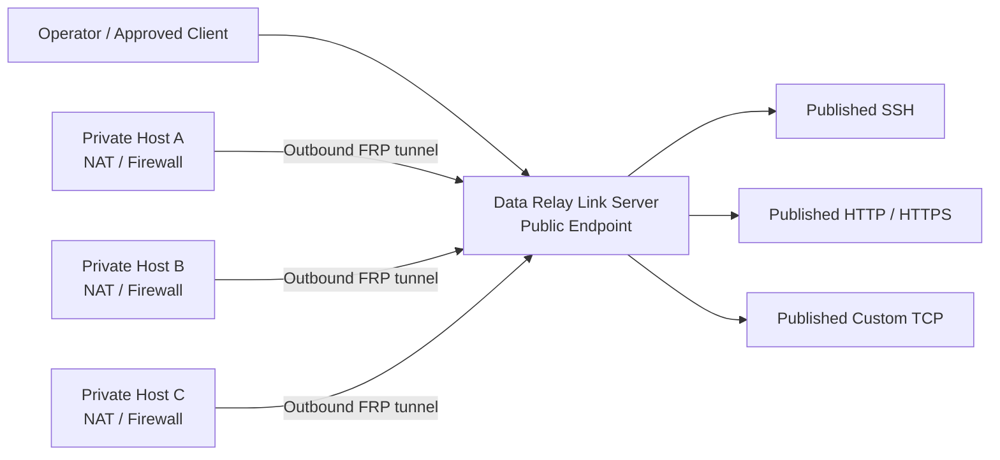

<h1 align="center">Data Relay Link</h1>

<p align="center">
  <strong>Secure Connectivity for Isolated Networks.</strong>
</p>

<p align="center">
  Relay only the connections that are actually needed instead of joining entire networks.
</p>

<p align="center">
  <strong>English</strong> · <a href="README.ko.md">한국어</a> · <a href="https://link.datarelay.run/">Product Website</a>
</p>

<p align="center">
  
  
  
  
</p>

<p align="center">
  <strong>Product website:</strong> <a href="https://link.datarelay.run/">link.datarelay.run</a>
</p>

---

## Connect only what is needed

Data Relay Link is a lightweight, CLI-first secure connectivity layer built on the official pinned [`fatedier/frp`](https://github.com/fatedier/frp).

It lets systems behind NAT, firewalls, and restricted networks initiate outbound connectivity to a server you control, then exposes only the specific services you intentionally publish.

It is designed to avoid the operational overhead of a full VPN, network overlay, RMM platform, or custom FRP fork.

## What it does

| Capability | What Data Relay Link provides |
|---|---|
| **Zero-Touch enrollment** | Fast client onboarding with short-lived enrollment credentials |
| **Stable identity** | Immutable client identity and persistent service identity |
| **Stable endpoints** | Public-port reservations preserved across normal lifecycle operations |
| **Service publishing** | SSH, HTTP, HTTPS passthrough, and Custom TCP |
| **LAN reachability** | Publish services on the local client or another reachable internal-LAN host |
| **Access control** | Named Access Lists, temporary TTL sources, and connection authorization logs |
| **Health & operations** | Target health checks, support bundles, lifecycle commands, backup/restore |
| **Cross-platform clients** | Linux, macOS, and Windows according to the validated platform matrix |
| **Single operator interface** | `sudo frpctl` for normal management |

## Architecture



The server remains Linux-based. macOS and Windows are supported client platforms according to release validation.

## Release status

Current project version: **2.3.0**  
Current pinned FRP version: **v0.71.0**  
Current line: **v2.3.0 FINAL AUDIT CLOSURE**

This default `main` branch documents the v2.3.0 stable/audit-closure line. Field installs should follow the immutable release identity rather than mutable `main`.

Following mutable `main` is explicit opt-in only:

```text
FRP_RELEASE_CHANNEL=dev
```

A legacy client on an older updater may require the documented **one-time verified bridge** before it can enter the current immutable release flow.

The next-generation v2.4.0 control-plane redesign is developed separately on:

[`feature/v2.4.0-final-product-closure`](https://github.com/datarelay-labs/data-relay-link/tree/feature/v2.4.0-final-product-closure)

Do not treat development-branch v2.4.0 target behavior as a stable v2.3.0 capability until it is integrated and qualified on an immutable exact HEAD.

## Quick start

For the v2.3.0 stable line, the current README contract uses the immutable release installer path:

```bash
curl -fsSL \
  https://raw.githubusercontent.com/xdr-labs/frp-auto-deploy/v2.3.0/dist/bootstrap-server.sh \
  | sudo bash
```

Then verify:

```bash
sudo frpctl show version
sudo frpctl show status
sudo frpctl doctor
```

Data Relay Link does **not** automatically modify external firewall/NAT rules, cloud security groups, DNS-provider records, SSH accounts, or application certificates.

For current product documentation, start at **https://link.datarelay.run/**.

## Deployment modes

### Direct

Typical public ports in the v2.3.0 line:

```text
TCP/443        FRP control
TCP/6099       Enrollment / management HTTPS
TCP/6000-6098 Published services
```

### Enterprise single-443

For environments that require control and enrollment on TCP/443:

```text
Public TCP/443
  ├─ HTTPS enrollment / management
  └─ FRP control over WSS

Published services
  └─ TCP/6000-6098
```

NAT is network topology, not a separate product mode.

## Zero-Touch enrollment

On the server:

```bash
sudo frpctl
```

Then use the guided flow:

```text
create zero-touch
```

Or create an explicit SSH enrollment:

```bash
sudo frpctl create enrollment \
  --one-line \
  --ssh \
  --ssh-user admin \
  --label branch-a
```

Interactive creation may prompt:

```text
Client SSH user: admin
```

There is **no default username**. The target OS account must already exist.

Zero-Touch does **not**:

- create an OS user
- install or enable an SSH server
- set a password
- create or modify SSH keys
- rewrite `sshd_config`

Connect to a published SSH service with the assigned public endpoint:

```bash
ssh -p <public-port> user@<public-hostname>
```

## Service lifecycle

These operations intentionally have different meanings:

```text
disable   != release
revoke    != release
uninstall != release
update    != re-enrollment
```

| Operation | Identity | Public port |
|---|---|---|
| Disable / enable service | kept | same reservation reused |
| Edit service | kept | preserved |
| Revoke client | management blocked | reserved |
| Release service | client kept | released for that service |
| Release client | removed | released |
| Local client uninstall | server identity remains | reserved |
| Normal update | preserved | preserved |

Normal updates are designed to preserve identity, services, and public-port reservations.

## Supported client platforms — v2.3.0

Real-host validation and CI/container portability are deliberately separated.

| Platform | Current claim |
|---|---|
| Ubuntu 24 physical host | **Real E2E validated** |
| Rocky Linux 8.10 | **Real E2E validated** |
| Rocky Linux 9.4 | **Real E2E validated** |
| Amazon Linux 2023 | **Real E2E validated** |
| macOS Apple Silicon | **Real E2E validated** |
| Windows 10 / PowerShell 5.1 | **Real E2E validated** |
| Amazon Linux 2 | Container / CI portability only |
| PowerShell 7 | CI validated; same-host Real E2E only where `pwsh` is present |

The authoritative release-validation classification is [`docs/RELEASE_VALIDATION.md`](docs/RELEASE_VALIDATION.md).

## Security model

The management plane is designed to fail closed.

- HTTPS-only enrollment/management
- private CA and CA pinning during bootstrap
- persistent client management identity
- signed requests
- timestamp and nonce replay protection
- high-entropy, TTL, single-use Zero-Touch credentials
- first-machine binding
- bootstrap secrets hashed at rest
- FRP tunnel credentials separated from management identity
- SHA256 integrity verification for installer/release artifacts

See [`docs/SECURITY.md`](docs/SECURITY.md).

## Product boundaries

Data Relay Link is intentionally **not**:

- a full VPN or transparent network overlay
- a Web-UI-first RMM platform
- a Kubernetes or large fleet-management platform
- an automatic cloud firewall/NAT/DNS manager
- an SSH account/password/key management system
- a custom fork of FRP

The v2.3.0 line is intended for approximately **1–50 clients**.

## Documentation

| Topic | Link |
|---|---|
| Product website | **https://link.datarelay.run/** |
| v2.4.0 development branch | [`feature/v2.4.0-final-product-closure`](https://github.com/datarelay-labs/data-relay-link/tree/feature/v2.4.0-final-product-closure) |
| v2.3.0 legacy documentation | https://frp.xdr.ooo |
| CLI Reference | [`docs/CLI_REFERENCE.md`](docs/CLI_REFERENCE.md) |
| Deployment modes | [`docs/DEPLOYMENT_MODES.md`](docs/DEPLOYMENT_MODES.md) |
| Security | [`docs/SECURITY.md`](docs/SECURITY.md) |
| Release validation | [`docs/RELEASE_VALIDATION.md`](docs/RELEASE_VALIDATION.md) |
| Upgrade | [`docs/FRP_UPGRADE.md`](docs/FRP_UPGRADE.md) |
| Product Master | [`docs/PRODUCT_MASTER.md`](docs/PRODUCT_MASTER.md) |
| Release history | [`CHANGELOG.md`](CHANGELOG.md) |

## License

**Data Relay Link is source-available, not open source.**

The **Data Relay Source Available License 1.0** permits personal use, research, evaluation, internal commercial use, internal modification, and customer-owned deployment under its terms.

Resale, OEM/embedding, white-labeling, commercial redistribution, derivative or competing commercial products, and SaaS/MSP/hosted offerings of the software's functionality require a separate written commercial license.

See [`LICENSE`](LICENSE) and [`LICENSING.md`](LICENSING.md) for details.

---

<p align="center">
  <strong>Simple to deploy. Simple to understand. Safe to operate. Lightweight by design.</strong>
</p>

<p align="center">
  <a href="https://link.datarelay.run/">Product Website</a> ·
  <a href="docs/CLI_REFERENCE.md">CLI Reference</a> ·
  <a href="docs/RELEASE_VALIDATION.md">Release Validation</a>
</p>
