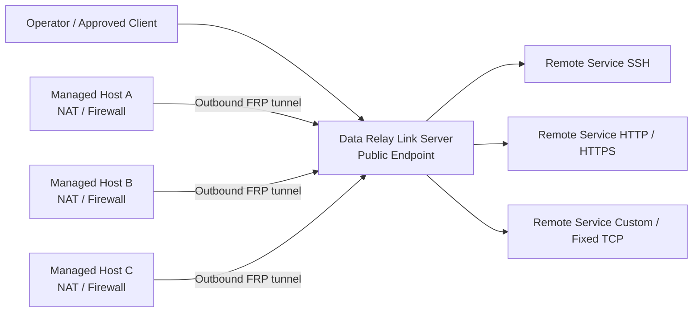

<h1 align="center">Data Relay Link</h1>

<p align="center">
  <strong>Secure Connectivity for Isolated Networks.</strong>
</p>

<p align="center">
  Relay only the connections that are actually needed instead of joining entire networks.
</p>

<p align="center">
  <strong>English</strong> · <a href="README.ko.md">한국어</a> · <a href="https://link.datarelay.run/">Product Website</a>
</p>

<p align="center">
  
  
  
  
  
</p>

<p align="center">
  <strong>Product website:</strong> <a href="https://link.datarelay.run/">link.datarelay.run</a>
</p>

---

> **License — Source Available:** Data Relay Link is free for personal use and for an organization's own internal commercial operations. Internal source modifications are allowed. Resale, commercial redistribution, OEM/white-label use, competing or derivative commercial products, and SaaS/hosted/managed-service offerings require a separate written commercial license. See [LICENSE](LICENSE) and [LICENSING.md](LICENSING.md).

## Connect only what is needed

Data Relay Link is a lightweight, CLI-first secure connectivity layer built on the official pinned [`fatedier/frp`](https://github.com/fatedier/frp).

It lets systems behind NAT, firewalls, and restricted networks initiate outbound connectivity to a server you control, then exposes only the specific services you intentionally publish.

It is designed to avoid the operational overhead of a full VPN, network overlay, RMM platform, or custom FRP fork.

```text
Remote Access     outside → inside
Internet Access   inside → approved Internet destinations
AI Access         authenticated AI Identity → approved target permissions
```

> **Branch status:** This repository tree is the **v2.4.0 final-product-closure** candidate. The canonical target architecture is documented and implemented on this branch, but there is no stable `v2.4.0` tag until exact-HEAD qualification completes. Do not treat this branch as a stable release. The published stable line remains **v2.3.0**.

Current project version: **2.4.0**  
Current pinned FRP version: **v0.71.0**  
Prepared release — v2.4.0 (tag pending). A `v2.4.0/dist/bootstrap-server.sh` URL would 404 until the immutable tag exists.

## What it does

| Capability | What Data Relay Link provides |
|---|---|
| **Zero-Touch enrollment** | Fast Managed Host onboarding with short-lived enrollment credentials |
| **Stable identity** | Immutable Managed Host identity and persistent Remote Service identity |
| **Stable endpoints** | Public-port reservations preserved across normal lifecycle operations |
| **Remote Services** | SSH, HTTP, HTTPS passthrough, Custom TCP, and Fixed TCP Service Objects |
| **LAN reachability** | Publish on the local Managed Host or another reachable internal-LAN host |
| **Access Policy** | BLACKLIST / WHITELIST Remote, Internet, and AI Access |
| **AI Access / MCP** | Verified AI Identity → approved target permissions |
| **Health & operations** | Doctor, support bundles, lifecycle commands, backup/restore |
| **Cross-platform clients** | Linux, macOS, and Windows according to the validated platform matrix |
| **Single operator interface** | `sudo drlink` for normal management |

## Architecture



v2.4.0 control-plane target:

```text
                    Data Relay Link
                          │
                 Embedded SQLite SSOT
                          │
          ┌───────────────┼───────────────┐
          ▼               ▼               ▼
   Remote Access    Internet Access      AI Access
   inbound relay    controlled egress    MCP Bridge
```

Control-plane state:

```text
/var/lib/drlink/drlink.db
```

No external database service is required. The server remains Linux-based. macOS and Windows are supported client platforms according to release validation.

## Key model

```text
Managed Host / DRLink Agent

Network Object / Network Group
Service Object / Service Group
Permission Object / Permission Group

AI Identity
Remote Service

Remote Access
Internet Access
AI Access

BLACKLIST / WHITELIST
```

Initial policy state is No Policy / No Rules with effective access ALLOW.
When a policy is created, BLACKLIST means matching enabled Rules deny and
WHITELIST means matching enabled Rules allow. Rules are not ordered and do not
carry per-rule ALLOW/DENY actions.

## Remote Access

Remote Access uses official pinned `fatedier/frp` as its relay engine. Data Relay Link does not fork FRP.

A Remote Service represents real connectivity owned by an Agent Host:

```text
Agent Host
+ single destination
+ one Service Object
→ Remote Service
→ stable DRLink endpoint
```

Remote Service supports TCP and Fixed TCP Service Objects. When the destination
is another host, the current Agent Host is the Relay Host.

Effective inbound access requires:

```text
Enabled Remote Service
+
Reachable connector/target
+
Remote Access policy permits the flow
(or no policy is configured)
```

A policy Rule authorizes or denies access according to BLACKLIST/WHITELIST mode;
it never creates connectivity.

## Internet Access

Protected hosts can use standard HTTP/HTTPS proxy settings. The gateway allows only explicitly authorized destinations/protocols/ports.

Security includes:

```text
BLACKLIST / WHITELIST policy enforcement
fail-closed unsafe-destination checks
server-side DNS
DNS rebinding resistance
SSRF/private/local/metadata protection
safe CONNECT/SNI behavior
explicit public Host/CIDR policy where supported
Fixed TCP through the same authority
```

Technical capability name: **Controlled Egress**. Normal CLI/resource name: **Internet Access**.

## AI Access / MCP

MCP is included in the v2.4.0 architecture.

```text
AI Host / tool
   │
 MCP over HTTPS
   │
Data Relay Link Server MCP Bridge
   │
AI Access policy
   │
existing authenticated DRLink control path
   │
Managed Host / private target
```

AI Access source is a verified **AI Identity**. Capability and path permissions are granted through Permission Objects / Permission Groups. MCP is an integration layer, not a separate public identity model.

## CLI

Primary operator interface:

```bash
sudo drlink
```

v2.4 guided and direct surfaces use the public nouns above. See:

- [`docs/Data Relay Link CLI Information Architecture.md`](docs/Data%20Relay%20Link%20CLI%20Information%20Architecture.md)
- [`docs/CLI_REFERENCE.md`](docs/CLI_REFERENCE.md)
- [`docs/DATA_RELAY_LINK_CLI_AI_MASTER_v2.4_FINAL.md`](docs/DATA_RELAY_LINK_CLI_AI_MASTER_v2.4_FINAL.md)

## Release status

```text
PROJECT_VERSION=2.4.0
RELEASE_CHANNEL=development
FRP_VERSION=0.71.0
```

There is no stable `v2.4.0` tag until exact-HEAD qualification is complete.

Pre-tag installers/bootstrap must use an immutable exact SHA or immutable candidate artifact, never a future nonexistent stable tag.

Repository: [`datarelay-labs/datarelay-link`](https://github.com/datarelay-labs/datarelay-link)  
Branch: [`feature/v2.4.0-final-product-closure`](https://github.com/datarelay-labs/datarelay-link/tree/feature/v2.4.0-final-product-closure)

The published stable line remains **v2.3.0** on `main`. Field installs of the stable line should follow the immutable release identity rather than mutable `main`. Following mutable `main` is explicit opt-in only:

```text
FRP_RELEASE_CHANNEL=dev
```

A legacy client on an older updater can use a one-time verified bridge; it cannot replace current upgrade policy.

## Quick start (candidate branch)

Until `v2.4.0` is tagged, install from this branch's exact candidate HEAD / artifacts only as directed by the release checklist and owner-gated manual E2E — do not invent a stable-tag URL.

```bash
sudo drlink show version
sudo drlink show status
sudo drlink system diagnostics
```

Data Relay Link does **not** automatically modify external firewall/NAT rules, cloud security groups, DNS-provider records, SSH accounts, or application certificates.

## Zero-Touch enrollment

After a Managed Host enrolls and a Remote Service is enabled, operators connect with the reserved public endpoint:

```text
ssh -p <public-port> user@<public-hostname>
```

Connect a client with zero-touch:

```text
set client --one-line --ssh-user ubuntu
```

Interactive create-client still prompts `Client SSH user`. There is no default username.

Zero-touch `--one-line` does **not**:
- join entire networks
- skip enrollment authentication

## Policy safety

```text
fail closed on unsafe destinations
no silent cascade deletes of referenced resources
access-broadening confirmation where required
ConfigurationBundle dry-run / apply with impact reporting
```

## Backup and restore

The control DB uses SQLite WAL mode. A live DB is backed up with SQLite Online Backup/equivalent consistent snapshot, not a naive file copy.

Restore validates schema/integrity and recompiles runtime policy from the DB.

## Documentation

Public docs: https://link.datarelay.run

Start here:

- [`docs/PRODUCT_MASTER.md`](docs/PRODUCT_MASTER.md) — product-level decisions.
- [`docs/CONTROL_PLANE_ARCHITECTURE.md`](docs/CONTROL_PLANE_ARCHITECTURE.md) — internal architecture/history; public semantics remain governed by the Product Master and CLI/AI Master.
- [`docs/Data Relay Link CLI Information Architecture.md`](docs/Data%20Relay%20Link%20CLI%20Information%20Architecture.md) — CLI UX.
- [`docs/CLI_REFERENCE.md`](docs/CLI_REFERENCE.md) — target direct grammar.
- [`docs/CONFIGURATION_BUNDLE.md`](docs/CONFIGURATION_BUNDLE.md) — declarative configuration, AI copy/paste, and bounded Zero-Touch contract.
- [`docs/CONTROLLED_EGRESS.md`](docs/CONTROLLED_EGRESS.md) — Internet Access behavior.
- [`docs/SECURITY.md`](docs/SECURITY.md) — security boundaries.
- [`docs/VERSION_POLICY.md`](docs/VERSION_POLICY.md) — version/release rules.
- [`docs/RELEASE_CHECKLIST.md`](docs/RELEASE_CHECKLIST.md) — final stable gate.

## Non-goals

v2.4.0 does not require:

```text
Web UI
external database server
central SaaS control plane
HA database cluster
hundreds/thousands-client orchestration
VPN/full network overlay
SASE/SWG/CASB/DLP
TLS inspection
automatic firewall/DNS management
```

## Release rule

Stable release requires two complete Real E2E passes on the same final exact HEAD, including the three access planes and applicable lifecycle/platform gates.

Any code/dependency change resets the pass counter.
